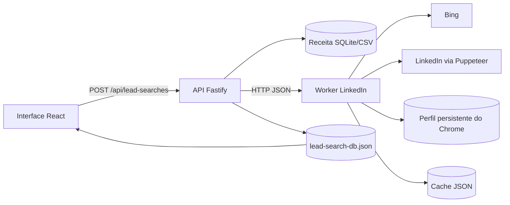

# Scraper do LinkedIn — funcionamento ponta a ponta

Este documento descreve o comportamento **implementado hoje** no SignalBase Final MVP. Ele cobre o caminho usado pela busca da interface, o worker Puppeteer, os contratos HTTP, sessão, cache, qualidade, erros e diagnóstico operacional.

> Escopo importante: o projeto não usa uma API oficial nem uma API paga de busca do LinkedIn. O chamado “scraper” é um worker Node.js que controla Chrome/Edge com Puppeteer usando uma sessão persistente do operador. Ele não contorna CAPTCHA, checkpoint ou verificação de segurança.

## 1. Resumo executivo

O fluxo real é composto por quatro partes:

1. a interface cria uma busca de leads na API;
2. a API lê empresas candidatas na base local da Receita Federal;
3. para cada candidata, a API chama o worker do LinkedIn para localizar a Company Page, extrair dados corporativos e procurar decisores;
4. a API cruza os decisores com os sócios da Receita, escolhe contatos, calcula a qualidade e persiste o resultado.



No modo `real`, uma URL do LinkedIn sozinha não prova que a empresa ou o decisor foram validados. O pipeline diferencia:

- `url_only`: apenas uma URL de Company Page;
- `real_company_data`: página com dados corporativos extraídos;
- decisor real: perfil com `associationVerified=true`;
- match sócio–decisor: similaridade nominal mínima de 70%, podendo haver corte maior conforme o filtro.

## 2. Estado observado em 21/07/2026

No momento desta documentação, o ambiente local estava configurado assim:

```dotenv
LINKEDIN_ENABLED=true
LINKEDIN_WORKER_MODE=real
WORKER_URL=http://127.0.0.1:8010
PUPPETEER_HEADLESS=true
PUPPETEER_NAVIGATION_TIMEOUT_MS=45000
PUPPETEER_MIN_DELAY_MS=1500
PUPPETEER_MAX_COMPANY_CANDIDATES=3
PUPPETEER_MAX_PEOPLE_SEARCHES=8
PUPPETEER_EXTRACT_PROFILE_CONTACTS=true
PUPPETEER_MAX_CONTACT_PROFILES=3
```

Os diagnósticos locais mostraram:

- API `2.1.0` disponível;
- worker `3.2.0` disponível no modo `real`;
- navegador conectado;
- sessão do LinkedIn autenticada;
- última operação registrada pelo worker: busca de decisores;
- erro funcional mais recente no worker: nenhum decisor com vínculo atual comprovado;
- busca de leads analisada originalmente bloqueou após 50 candidatas, com erro de abort classificado como indisponibilidade;
- cache contendo falhas do Bing como `ERR_HTTP2_PROTOCOL_ERROR`, `ERR_CONNECTION_CLOSED` e `Execution context was destroyed`;
- vários resultados `no_verified_match` na busca de decisores.

Conclusão do snapshot: **o worker e a autenticação estavam funcionando**, mas o pipeline falhava em navegação/resolução e em extrair decisores verificáveis. A versão atual aplica deadline e cancelamento ponta a ponta, libera a fila em abort/deadline e diferencia backpressure de indisponibilidade. Além disso, a busca observada exigia simultaneamente e-mail, telefone, celular, contato não genérico e match sócio–decisor; portanto, “zero leads válidos” não significa necessariamente “zero páginas raspadas”.

## 3. Componentes e responsabilidades

| Componente | Arquivo principal | Responsabilidade |
| --- | --- | --- |
| Interface | `apps/web/src/ProductApp.tsx` | cria buscas, acompanha progresso e exibe diagnóstico do LinkedIn |
| Rotas da busca | `apps/api/src/leadSearch/routes.ts` | valida requisições e expõe busca, pausa, retomada, resultados e exportação |
| Orquestração | `apps/api/src/leadSearch/service.ts` | lê candidatas em lotes, processa uma a uma e persiste o progresso |
| Enriquecimento | `apps/api/src/enrich.ts` | resolve URL, extrai empresa, pesquisa decisores e monta o lead enriquecido |
| Validação final | `apps/api/src/leadSearch/leadProcessor.ts` | cruza sócio e decisor, seleciona contatos, calcula score e aceita/rejeita |
| Cliente do worker | `apps/api/src/workerClient.ts` | contratos HTTP, timeout, identidade do worker e erros bloqueantes |
| Servidor do worker | `services/linkedin-worker/src/server.mjs` | expõe os endpoints HTTP do scraper |
| Navegação | `services/linkedin-worker/src/linkedin-browser.mjs` | controla Puppeteer, serializa páginas e executa as buscas |
| Extração | `services/linkedin-worker/src/extractors.mjs` | normaliza URLs, interpreta DOM/texto, pontua empresas e valida vínculo |
| Sessão | `services/linkedin-worker/src/login.mjs` | abre navegador visível e persiste login no perfil dedicado |
| Cache | `services/linkedin-worker/src/cache.mjs` | persiste respostas em JSON com TTL |

## 4. Modos de operação

### 4.1 LinkedIn desligado

```dotenv
LINKEDIN_ENABLED=false
```

A API não chama o worker. O lead é avaliado apenas com dados locais da Receita, site, e-mail e telefone. A qualidade `muito_alto` é bloqueada na criação da busca.

### 4.2 Demo

```dotenv
LINKEDIN_ENABLED=true
LINKEDIN_WORKER_MODE=demo
```

O worker não abre LinkedIn. Ele gera:

- Company Page determinística a partir do nome;
- perfil de empresa fictício;
- decisor a partir do primeiro sócio, quando disponível;
- e-mail sintético quando existe domínio corporativo.

As respostas usam marcadores como `demo_generated` e não devem ser usadas comercialmente. Uma interface aparentemente “funcionando” nesse modo não valida o scraper real.

### 4.3 Real

```dotenv
LINKEDIN_ENABLED=true
LINKEDIN_WORKER_MODE=real
```

O worker inicia Puppeteer sob demanda, reutiliza `LINKEDIN_BROWSER_PROFILE_DIR` e executa navegação real. O navegador pode ser headless, mas o login inicial precisa ser feito de forma visível.

## 5. Inicialização do sistema

O comando principal é:

```powershell
npm run dev
```

Ele inicia em paralelo:

- `npm run dev:worker`;
- `npm run dev:api`;
- `npm run dev:web`.

O script `scripts/run-worker.mjs` verifica a porta do worker antes de iniciar outro processo. Ele só reutiliza um processo existente se `/health` confirmar:

- identidade `signalbase-final-mvp-linkedin-worker`;
- implementação `puppeteer`;
- versão `3.2.0`;
- mesmo modo configurado na API.

Se a porta estiver ocupada por outro processo, por uma versão antiga ou por um worker em outro modo, o boot falha explicitamente.

O worker lê o `.env` da raiz. Variáveis já presentes em `process.env` têm prioridade. Caminhos relativos de perfil e cache são resolvidos contra a raiz do projeto.

## 6. Preparação e persistência da sessão

O login é feito com:

```powershell
npm run linkedin:login
```

O script:

1. cria o diretório de perfil;
2. abre Chrome/Edge com `headless: false`;
3. navega para `https://www.linkedin.com/login`;
4. aguarda o operador concluir login e qualquer verificação;
5. espera Enter no terminal;
6. fecha o navegador, preservando cookies e storage no perfil.

Antes de executar o login, pare o worker que usa o mesmo perfil. Dois processos Chromium não devem abrir simultaneamente o mesmo `userDataDir`.

O perfil padrão é:

```text
data/linkedin-browser-profile/
```

Ele está fora do Git e deve ser tratado como segredo, pois contém a sessão autenticada.

### Observação sobre Docker

No `docker-compose.yml`, o worker usa `/app/data/linkedin-browser-profile` dentro de um volume nomeado. Esse perfil **não é o mesmo** perfil criado no host por `npm run linkedin:login`. Além disso, o Compose força `PUPPETEER_HEADLESS=true`.

Logo, fazer login no host e depois iniciar o worker em Docker não transfere automaticamente a sessão. Para Docker, o perfil autenticado precisa existir no volume do container por um procedimento operacional próprio e autorizado.

## 7. Entrada principal: criação de uma busca

A interface usa:

```http
POST /api/lead-searches
```

Exemplo simplificado:

```json
{
  "uf": "SC",
  "cnaes": ["7311400"],
  "targetQuantity": 100,
  "minQuality": "alto",
  "requirePhone": true,
  "requireEmail": true,
  "requireDecisionMakerMatch": true,
  "onlyMobilePhone": true,
  "excludeGenericContacts": true,
  "matchConfidenceLevel": "normal"
}
```

A API valida e normaliza os filtros, grava uma busca com status `queued`, responde `202` e agenda o processamento em segundo plano.

## 8. Seleção de candidatas na Receita

O `LeadSearchService` consulta a fonte configurada por:

- UF;
- cidade opcional;
- um ou mais CNAEs;
- preferências de contato usadas para priorização.

No SQLite atual, sem o índice recomendado, a descoberta é streaming. A contagem de candidatas começa como limite inferior (`lower_bound`) e cresce conforme os lotes são lidos. O tamanho padrão do lote é `LEAD_SEARCH_BATCH_SIZE=25`.

Para cada empresa, a fonte entrega:

- CNPJ;
- razão social e nome fantasia;
- cidade, UF e CNAE principal;
- sócios;
- e-mail, telefone, site e LinkedIn, quando disponíveis na fonte.

O serviço processa as candidatas sequencialmente dentro de cada busca. Ao final de cada candidata, persiste o resultado e incrementa `totalProcessed`.

## 9. Enriquecimento de uma candidata

O caminho principal é:

```text
LeadSearchService.runJob
  -> EnrichmentLeadProcessor.process
    -> enrichCompany
      -> enrichOne
        -> resolveLinkedInUrl
        -> extractCompany
        -> searchDecisionMakers
      -> evaluateEnrichedLead
```

### 9.1 Normalização

A API limpa espaços, mantém apenas dígitos no CNPJ e deriva um domínio do site ou do e-mail. Se `BRASILAPI_ENABLED=true` e faltarem dados suficientes, ela pode tentar complementar a entrada antes do LinkedIn.

### 9.2 URL já conhecida

Se a fonte local já contém `linkedin.com/company/...`, a API normaliza a URL e atribui:

- `provider=input`;
- confiança `99`;
- evidência inicial apenas de URL.

Mesmo assim, para qualidade média ou superior, a página ainda é aberta para validar conteúdo real.

### 9.3 Resolução da Company Page

Sem URL conhecida, a API chama:

```http
POST /company/resolve
```

Payload típico enviado ao worker:

```json
{
  "cnpj": "11222333000181",
  "company_name": "Tech Azul",
  "trading_name": "Tech Azul",
  "legal_name": "Tech Azul Solutions LTDA",
  "domain": "techazul.com.br",
  "website": "https://techazul.com.br",
  "email": "contato@techazul.com.br",
  "city": "Florianópolis",
  "uf": "SC"
}
```

O worker gera até cinco consultas com combinações de:

- nome limpo, sem sufixos como LTDA, SA, ME e EPP;
- domínio;
- cidade e UF;
- restrição textual `site:linkedin.com/company`.

Primeiro ele pesquisa no Bing. Se ainda houver menos candidatas que `PUPPETEER_MAX_COMPANY_CANDIDATES`, usa as duas primeiras consultas na busca interna de empresas do LinkedIn.

URLs são normalizadas para:

```text
https://www.linkedin.com/company/<slug>
```

Parâmetros, `/about/`, idioma e tracking são removidos.

### 9.4 Validação e score da Company Page candidata

Para até três candidatas, o worker abre:

```text
https://www.linkedin.com/company/<slug>/about/
```

Cada página recebe um score que considera:

- similaridade do nome esperado com o nome extraído: até 70 pontos;
- similaridade com o slug: até 58;
- similaridade com o contexto do resultado: até 52;
- domínio exato: +30;
- domínio no contexto: +15;
- cidade na sede: +8;
- UF na sede: +4;
- extração corporativa bem-sucedida: +8.

O score é limitado a 99. A URL só é aceita quando a melhor candidata atinge pelo menos 55.

O resultado pode ser:

- `company_verified`: URL e dados corporativos reais;
- `url_only`: URL plausível, mas sem conteúdo corporativo suficiente;
- falha: nenhuma URL ou nenhuma candidata acima do corte.

## 10. Extração da empresa

A API chama:

```http
POST /company/extract
```

O worker coleta um snapshot semântico de `main` ou `body`:

- URL e título;
- texto visível;
- cabeçalho;
- `h1` e `h2`;
- meta description;
- links;
- pares de `dt/dd` e listas que parecem chave/valor;
- indícios de sessão autenticada.

O extrator tenta obter:

- nome;
- descrição;
- site;
- setor;
- tamanho da empresa;
- mínimo e máximo de funcionários;
- sede;
- ano de fundação;
- seguidores.

A extração só tem `success=true` quando há nome **e** pelo menos uma evidência corporativa relevante. Abrir a URL sem esses campos produz `no_verified_match` e nível `url_only`.

## 11. Detecção de autenticação e bloqueios

Toda página relevante é classificada por `pageState`.

| Código | Detecção | Comportamento esperado |
| --- | --- | --- |
| `auth_required` | URL de login/authwall ou texto pedindo login | exige novo `linkedin:login` |
| `challenge` | checkpoint, challenge, CAPTCHA ou verificação humana | exige intervenção manual |
| `navigation_error` | página sem conteúdo visível ou falha de navegação | não é tratado como bloqueio global pela API atual |
| `no_verified_match` | página abriu, mas não gerou evidência suficiente | candidata continua como não validada |
| `wrong_worker` | identidade, versão ou modo divergentes | bloqueia a busca |
| `worker_unauthorized` | token do worker ausente ou inválido | bloqueia a busca |
| `worker_unavailable` | conexão, parse ou navegador indisponível | bloqueia a busca |
| `deadline_exceeded` | orçamento absoluto da operação esgotado | bloqueia a busca |
| `request_cancelled` | cliente/API cancelou a operação | bloqueia a busca |
| `queue_timeout` / `queue_full` | backpressure da fila serial | bloqueia a busca |

Erros bloqueantes na API incluem autenticação, challenge, worker incorreto, worker indisponível, autorização do worker, deadline, cancelamento e backpressure. Quando um deles sobe até o `LeadSearchService`, a busca vira `blocked`, preservando a candidata atual para retomada.

## 12. Busca de decisores

Para qualidade `alta` ou `muito_alta` no enriquecimento legado — e sempre no caminho atual `enrichCompany`, que usa `muito_alta` internamente — a API chama:

```http
POST /decision-makers/search
```

Payload típico:

```json
{
  "company_name": "Tech Azul",
  "linkedin_url": "https://www.linkedin.com/company/tech-azul-solutions",
  "domain": "techazul.com.br",
  "cnpj": "11222333000181",
  "partner_names": ["Marina Costa"],
  "keywords": [
    "CEO",
    "Founder",
    "Co-Founder",
    "Socio",
    "Diretor",
    "CTO",
    "Head of Technology",
    "Head of Sales",
    "Head of Growth"
  ],
  "max_results": 8
}
```

### 12.1 Ordem das pesquisas

O worker monta uma lista única com:

1. até os três primeiros sócios;
2. palavras-chave de cargo.

Depois corta a lista em `PUPPETEER_MAX_PEOPLE_SEARCHES`, cujo padrão é 8. Isso significa que muitos sócios podem reduzir a quantidade de cargos pesquisados.

Para cada termo, abre:

```text
https://www.linkedin.com/company/<slug>/people/?keywords=<termo>
```

A página é rolada três vezes. Links de perfis em `main` são coletados, enquanto textos de sidebar como “segue esta página”, “trabalha aqui” e “pessoas também viram” são descartados.

Perfis retornados pela aba `/people/` da própria empresa recebem:

- `associationVerified=true`;
- `associationMethod=company_people`;
- Company Page corrente associada.

### 12.2 Busca global de sócios não encontrados

Se um sócio não apareceu na página da empresa, o worker usa:

```text
https://www.linkedin.com/search/results/people/?keywords=<sócio + empresa>
```

Para cada candidato, abre:

```text
https://www.linkedin.com/in/<perfil>/details/experience/
```

O vínculo só é aceito quando uma experiência atual:

- aponta para a mesma Company Page; ou
- tem similaridade nominal de pelo menos 88% com a empresa esperada.

Nesse caso, `associationMethod=current_experience`.

### 12.3 Match com sócios

Os nomes são normalizados, sem acentos e pontuação. A comparação usa similaridade de tokens. Um decisor recebe `partner_match=true` a partir de 70%.

Depois, a API repete a comparação com os sócios da Receita e só considera decisores com vínculo verificado no modo real.

### 12.4 Contatos do perfil

Para os primeiros `PUPPETEER_MAX_CONTACT_PROFILES` decisores — padrão 3 — o worker abre:

```text
https://www.linkedin.com/in/<perfil>/overlay/contact-info/
```

Ele extrai:

- links `mailto:`;
- links `tel:`;
- e-mails encontrados no texto;
- telefones brasileiros que passem pela validação de quantidade de dígitos.

O LinkedIn frequentemente não expõe esses dados. Portanto, encontrar um decisor não garante obter e-mail ou telefone.

## 13. Escolha do contato final

A API combina:

- e-mails e telefones do decisor;
- e-mail e telefone locais da Receita.

Valores inválidos são removidos. A seleção respeita os filtros da busca:

- apenas telefone móvel;
- e-mail corporativo ou não corporativo;
- exclusão de e-mail genérico.

Preferências internas:

- contato do decisor antes do contato da empresa;
- celular antes de telefone fixo;
- e-mail corporativo e não genérico antes das outras opções.

## 14. Evidência, qualidade e aceitação

### 14.1 Evidência do LinkedIn

| Nível | Significado |
| --- | --- |
| `none` | nenhuma URL |
| `demo` | dado gerado no modo demo |
| `url_only` | URL encontrada, sem dados corporativos verificados |
| `company_data` | dados corporativos, mas não considerados reais pelo contexto |
| `real_company_data` | dados corporativos extraídos no modo real |

### 14.2 Qualidade calculada

- `baixo`: evidência insuficiente;
- `medio`: existe contato e algum sinal de LinkedIn, empresa ou site;
- `alto`: existe contato e dados fortes de empresa, decisor ou e-mail nominal;
- `muito_alto`: existe contato, decisor verificado, contato do decisor e match sócio–decisor com pelo menos 85%.

Para uma busca `alto` em modo real, as regras automáticas exigem:

- LinkedIn real;
- e-mail final não genérico, se houver e-mail;
- ao menos dados reais da empresa, decisor real ou e-mail cujo nome corresponda ao sócio/decisor.

Para `muito_alto`, exigem também:

- dados reais da empresa;
- decisor real;
- perfil LinkedIn do decisor;
- contato do decisor ou e-mail nominal;
- match sócio–decisor de pelo menos 95%.

Filtros marcados pelo usuário são cumulativos. Exigir e-mail + telefone + celular + match pode rejeitar uma empresa que foi raspada corretamente, mas não possui todos esses dados disponíveis.

## 15. Persistência e cache

### 15.1 Resultados da busca

As buscas, resultados e cross-matches são gravados atomicamente em:

```text
data/lead-search-db.json
```

Cada candidata vira um resultado `valid`, `rejected` ou `error`. O arquivo guarda evidências e motivos de rejeição.

### 15.2 Cache do worker

O cache padrão é:

```text
data/linkedin-browser-cache.json
```

TTL padrão: 168 horas, ou sete dias.

Há chaves separadas para:

- `resolve`;
- `company`;
- `people`;
- `contacts`.

O cache usa SHA-256 do payload e grava de modo serializado por arquivo temporário + rename. Respostas devolvidas do cache recebem `cached=true` quando o método adiciona esse marcador.

O arquivo é escrito com permissão restrita quando o sistema operacional permite, entradas expiradas são podadas no carregamento e uma falha de rename remove o temporário antes de propagar o erro.

Não são cacheados resultados cujo `errorCode` seja:

- `auth_required`;
- `challenge`;
- `navigation_error`;
- `network_error`;
- `deadline_exceeded`;
- `request_cancelled`;
- `queue_timeout`;
- `queue_full`;
- `worker_unavailable`;
- `worker_unauthorized`;
- `wrong_worker`.

Resultados negativos (`no_verified_match`, `no_company_candidate`, `company_not_verified`, `success=false`) e contatos vazios usam TTL curto configurável por `PUPPETEER_NEGATIVE_CACHE_TTL_MINUTES` e `PUPPETEER_EMPTY_CACHE_TTL_MINUTES`, ambos com padrão de 15 minutos. Sucessos verificados continuam usando `PUPPETEER_CACHE_TTL_HOURS`.

## 16. Concorrência, serialização e timeouts

A API possui:

- `ENRICH_CONCURRENCY`, usado por `/api/enrich` em lotes;
- `WORKER_CONCURRENCY`, limitador de chamadas do enriquecimento;
- `REQUEST_TIMEOUT_MS`, orçamento HTTP de cada chamada ao worker, padrão 120 segundos;
- `LEAD_OPERATION_TIMEOUT_MS`, orçamento da candidata completa;
- `WORKER_OPERATION_TIMEOUT_MS` e `WORKER_MAX_OPERATION_TIMEOUT_MS`, orçamento padrão e teto aceito pelo worker.

Independentemente desses valores, o worker mantém uma única fila global:

```text
queue: serial
```

Cada `withPage` aguarda o anterior, abre uma aba nova, executa a tarefa e fecha a aba. Navegações respeitam intervalo mínimo global de `PUPPETEER_MIN_DELAY_MS`.

Uma resolução pode executar pesquisas externas, buscas internas e extrações de Company Page. Antes de cada navegação, o worker exige margem mínima restante por `WORKER_MIN_NAVIGATION_BUDGET_MS`; se o orçamento não comporta a próxima etapa, a operação falha de forma tipada com `deadline_exceeded`.

O deadline absoluto é enviado em header e body, mas o worker aplica o orçamento desde o início da requisição HTTP, inclusive leitura do body. Desconexão do cliente, pausa/exclusão de busca e estouro de deadline abortam o contexto ativo. A fila libera o próximo item mesmo que uma chamada interna ignore o abort; páginas, navegador e shutdown têm fechamento limitado por timeout.

## 17. Diagnóstico e saúde

### 17.1 Health do worker

```powershell
Invoke-RestMethod http://127.0.0.1:8010/health | ConvertTo-Json -Depth 8
```

Campos importantes:

- `mode` e `runtimeMode`;
- `browser_connected`;
- `session_state`;
- `ready`;
- `last_operation`;
- `last_error`;
- `last_success_at`;
- `headless`;
- `readiness_reason`;
- métricas de fila (`queueDepth`, `activeOperation`, `queueMetrics`).

`/health` não navega até o LinkedIn. Ele mostra o último estado observado, mas `ready=true` só permanece enquanto a sessão autenticada estiver dentro de `WORKER_SESSION_FRESHNESS_MS`. Se a janela expirar, o worker informa `readiness_reason=session_stale` até uma checagem ativa bem-sucedida.

### 17.2 Teste ativo da sessão

```powershell
Invoke-RestMethod -Method Post `
  -Uri http://127.0.0.1:7001/api/linkedin/test `
  -ContentType 'application/json' `
  -Body '{}'
```

Esse endpoint chama `/session/check`, abre o feed e confirma o estado atual.

### 17.3 Smoke test completo

Primeiro pare o worker que estiver usando o perfil. Depois execute:

```powershell
npm run linkedin:smoke -- `
  --linkedin-url=https://www.linkedin.com/company/ventura-web-solutions `
  --company="VENTURA Web Solutions" `
  --partner="FABRICIO VENTURA"
```

O smoke usa navegador visível e cache temporário. Ele testa, em ordem:

1. sessão;
2. empresa;
3. decisores.

Esse é o teste mais útil para separar falha de login, falha do extrator de empresa e falha da busca de pessoas.

### 17.4 Busca bloqueada

Uma busca bloqueada só pode ser retomada pela API depois de um teste de sessão com `ready=true`:

```http
POST /api/lead-searches/<id>/resume
```

No caso de `queue_full`, `queue_timeout`, `deadline_exceeded` ou `worker_unavailable`, o teste de sessão pode passar mesmo que a causa real esteja em backpressure, rede ou navegador. Por isso a retomada também preserva o erro da candidata bloqueada para investigação.

## 18. Pontos de atenção operacional

1. **Dependência de fontes externas.** Bing, LinkedIn, rede e layout das páginas podem mudar ou impor limites próprios; falhas transitórias são tipadas e não são cacheadas.
2. **Fila única intencional.** O navegador continua serial para reduzir disputa por sessão/perfil. Backpressure é explícito por `queue_full` e `queue_timeout`.
3. **Sessão controlada pelo operador.** Login, challenge e expiração exigem ação humana; readiness stale bloqueia fluxo real até checagem ativa.
4. **Disponibilidade de contatos.** O overlay depende do que o LinkedIn revela para a conta autenticada; e-mail e telefone geralmente não são públicos.
5. **Docker e perfil local separados.** Login feito no host não autentica automaticamente o volume do container.
6. **Filtros cumulativos.** Exigir e-mail, telefone, celular, match e contato de decisor pode rejeitar empresas raspadas corretamente por ausência de dados suficientes.

## 19. Como interpretar “não está funcionando”

Use esta árvore de decisão:

```text
/health não responde
  -> worker parado, porta errada ou processo incompatível

/health responde, /api/linkedin/test falha com auth_required
  -> sessão ausente ou expirada

/api/linkedin/test falha com challenge
  -> verificação manual do LinkedIn

sessão passa, mas nenhuma Company Page é encontrada
  -> Bing/busca interna, nome/domínio insuficiente, cache negativo ou seletor

Company Page é encontrada, mas companyExtractionSuccess=false
  -> /about/ abriu sem campos reconhecidos, authwall parcial ou mudança de DOM

empresa é extraída, mas não há decisores
  -> /people/ não retornou perfis, filtro de sidebar descartou linhas,
     experiência atual não correspondeu ou cache people está negativo

decisor existe, mas lead é rejeitado
  -> faltou contato, celular, e-mail aceito, match de nome, score ou qualidade mínima

busca vira blocked com worker_unavailable / deadline_exceeded / queue_timeout
  -> navegador indisponível, rede, orçamento esgotado ou backpressure
```

## 20. Sequência recomendada para investigar o estado atual

1. Confirmar identidade e modo em `/health`.
2. Executar `/api/linkedin/test`; não confiar apenas em `session_state` antigo.
3. Parar o worker e executar o smoke com uma Company Page conhecida.
4. Observar separadamente os estágios `session`, `company` e `decision_makers`.
5. Verificar `errorCode`, `timing.remainingMs`, `queueWaitMs` e se a falha ocorreu por deadline ou fila.
6. Comparar erros de Bing com o fallback da busca interna do LinkedIn.
7. Inspecionar entradas `resolve`, `company` e `people` do cache sem expor cookies ou dados pessoais.
8. Durante a correção, usar uma busca pequena e filtros menos cumulativos para não confundir raspagem com rejeição de qualidade.
9. Só depois validar e-mail, celular e match sócio–decisor em conjunto.

## 21. Endpoints relacionados

| Método | Endpoint | Função |
| --- | --- | --- |
| `GET` | `/health` no worker | saúde passiva do worker |
| `POST` | `/session/check` no worker | teste ativo da sessão |
| `POST` | `/company/resolve` no worker | localizar e pontuar Company Page |
| `POST` | `/company/extract` no worker | extrair dados de `/about/` |
| `POST` | `/decision-makers/search` no worker | localizar, verificar e enriquecer decisores |
| `GET` | `/api/health` | saúde da API, Receita e worker |
| `GET` | `/api/capabilities` | capacidades exibidas pela interface |
| `POST` | `/api/linkedin/test` | proxy do teste ativo de sessão |
| `POST` | `/api/lead-searches` | criar busca assíncrona |
| `GET` | `/api/lead-searches/:id` | acompanhar progresso |
| `POST` | `/api/lead-searches/:id/resume` | retomar busca pausada/bloqueada |
| `GET` | `/api/lead-searches/:id/results` | listar válidos, rejeitados e erros |
| `GET` | `/api/lead-searches/:id/export.csv` | exportar resultados válidos |
| `POST` | `/api/enrich` | enriquecimento direto/legado por lote |

## 22. Variáveis de ambiente

| Variável | Padrão | Efeito |
| --- | --- | --- |
| `LINKEDIN_ENABLED` | `true` | liga/desliga todo o cruzamento |
| `LINKEDIN_WORKER_MODE` | `demo` | seleciona `demo` ou `real` |
| `WORKER_URL` | `http://127.0.0.1:8010` | endereço usado pela API |
| `WORKER_HOST` | `127.0.0.1` | bind do worker |
| `WORKER_PORT` | `8010` | porta do worker |
| `WORKER_AUTH_TOKEN` | vazio | token API -> worker; obrigatório no modo real fora de loopback |
| `LINKEDIN_BROWSER_PROFILE_DIR` | `data/linkedin-browser-profile` | sessão persistente |
| `LINKEDIN_CACHE_PATH` | `data/linkedin-browser-cache.json` | cache do scraper |
| `PUPPETEER_HEADLESS` | `true` | navegador oculto/visível |
| `PUPPETEER_EXECUTABLE_PATH` | autodetectado | Chrome/Edge usado pelo Puppeteer |
| `PUPPETEER_NAVIGATION_TIMEOUT_MS` | `45000` | timeout de cada navegação |
| `PUPPETEER_MIN_DELAY_MS` | `1500` | intervalo mínimo global entre navegações |
| `PUPPETEER_CACHE_TTL_HOURS` | `168` | validade do cache |
| `PUPPETEER_NEGATIVE_CACHE_TTL_MINUTES` | `15` | TTL curto de resultados negativos |
| `PUPPETEER_EMPTY_CACHE_TTL_MINUTES` | `15` | TTL curto de contatos vazios |
| `PUPPETEER_MAX_COMPANY_CANDIDATES` | `3` | páginas candidatas validadas |
| `PUPPETEER_MAX_PEOPLE_SEARCHES` | `8` | termos pesquisados por empresa |
| `PUPPETEER_EXTRACT_PROFILE_CONTACTS` | `true` | abre o overlay de contato |
| `PUPPETEER_MAX_CONTACT_PROFILES` | `3` | perfis com contato consultado |
| `REQUEST_TIMEOUT_MS` | `120000` | timeout HTTP API → worker |
| `WORKER_OPERATION_TIMEOUT_MS` | `110000` | orçamento padrão do worker |
| `WORKER_MAX_OPERATION_TIMEOUT_MS` | `300000` | maior deadline aceito pelo worker |
| `WORKER_MIN_NAVIGATION_BUDGET_MS` | `5000` | margem antes de iniciar navegação |
| `WORKER_QUEUE_WAIT_TIMEOUT_MS` | `30000` | espera máxima na fila serial |
| `WORKER_MAX_QUEUE_DEPTH` | `8` | profundidade máxima da fila serial |
| `WORKER_RESOURCE_CLOSE_TIMEOUT_MS` | `5000` | limite para fechar página/navegador |
| `WORKER_SHUTDOWN_TIMEOUT_MS` | `10000` | limite de espera no encerramento |
| `WORKER_SESSION_FRESHNESS_MS` | `900000` | janela de readiness da sessão |
| `WORKER_CONCURRENCY` | `1` | limite da API; o worker continua serial |
| `LEAD_SEARCH_BATCH_SIZE` | `25` | candidatas lidas por lote |

## 23. Segurança, conformidade e limites

- O perfil do navegador contém uma sessão autenticada e nunca deve ser versionado.
- O cache e os resultados podem conter dados pessoais e exigem retenção, acesso e descarte compatíveis com a LGPD.
- O operador é responsável pela autorização de uso, pelos termos do LinkedIn e pela base legal do tratamento.
- O worker não deve tentar contornar CAPTCHA, checkpoint, bloqueio ou controle de acesso.
- Em produção, o worker não deve ficar exposto publicamente. Ele não habilita CORS para chamadas do navegador e exige `WORKER_AUTH_TOKEN` quando o modo real escuta fora de loopback.
- E-mail ou telefone encontrado tecnicamente não implica consentimento para contato.

## 24. Critério de sucesso ponta a ponta

O scraper pode ser considerado operacional quando, com uma empresa conhecida e autorizada:

1. `/api/linkedin/test` retorna `ready=true`;
2. `/company/resolve` retorna a Company Page correta;
3. `/company/extract` retorna `success=true` e dados corporativos coerentes;
4. `/decision-makers/search` retorna pelo menos um perfil com `associationVerified=true`;
5. o match com um sócio conhecido é explicado e tem confiança coerente;
6. a busca não ultrapassa o timeout nem deixa a fila bloqueada;
7. uma nova busca persiste o cross-match e distingue corretamente resultado válido de rejeição por filtro.

Passar apenas no teste de sessão comprova autenticação; não comprova o pipeline completo.
